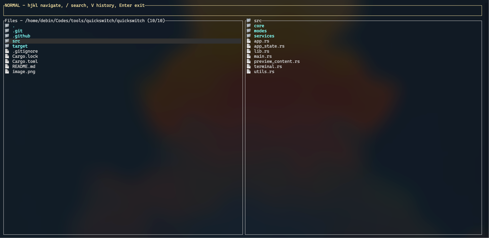
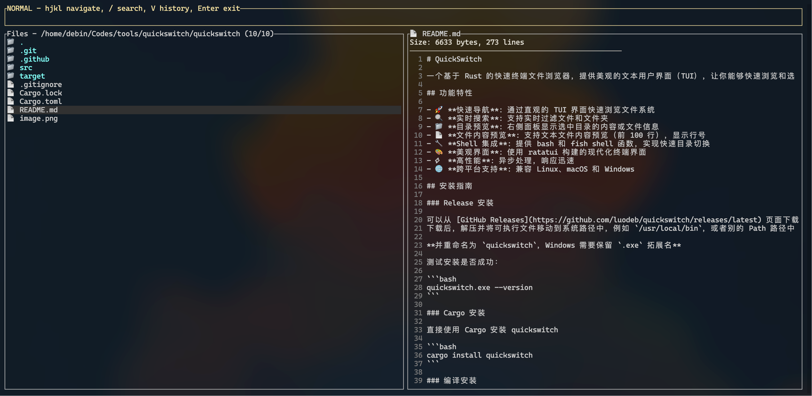
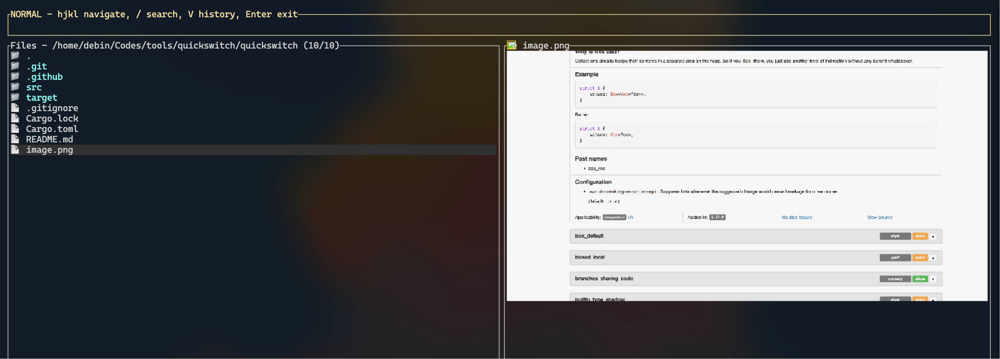

# QuickSwitch

一个基于 Rust 的快速终端文件浏览器，提供美观的文本用户界面（TUI），让你能够快速浏览和选择文件夹。

## 功能特性

- 🚀 **快速导航**: 通过直观的 TUI 界面快速浏览文件系统
- 🔍 **实时搜索**: 支持实时过滤文件和文件夹
- 📁 **目录预览**: 右侧面板显示选中目录的内容或文件信息
- 📄 **文件内容预览**: 支持文本文件内容预览（前 100 行），显示行号
- 🔧 **Shell 集成**: 提供 bash 和 fish shell 函数，实现快速目录切换
- 🎨 **美观界面**: 使用 ratatui 构建的现代化终端界面
- ⚡ **高性能**: 异步处理，响应迅速
- 🌐 **跨平台支持**: 兼容 Linux、macOS 和 Windows

## 界面预览

### 目录预览



### 文件内容预览



### 图片预览



## 安装指南

### Release 安装

可以从 [GitHub Releases](https://github.com/luodeb/quickswitch/releases/latest) 页面下载最新的二进制文件。
下载后，解压并将可执行文件移动到系统路径中，例如 `/usr/local/bin`，或者别的 Path 路径中。

**并重命名为 `quickswitch`，Windows 需要保留 `.exe` 拓展名**

测试安装是否成功：

```bash
quickswitch.exe --version
```

### Cargo 安装

直接使用 Cargo 安装 quickswitch

```bash
cargo install quickswitch
```

### 编译安装

#### 1. 克隆项目

```bash
git clone https://github.com/luodeb/quickswitch.git
cd quickswitch
```

#### 2. 编译项目

##### 开发版本

```bash
cargo build
```

##### 发布版本（推荐）

```bash
cargo build --release
```

编译完成后，可执行文件位于：

- 开发版本：`target/debug/quickswitch`
- 发布版本：`target/release/quickswitch`

#### 3. 安装到系统（可选）

```bash
# 安装到 ~/.cargo/bin
cargo install --path .

# 或者手动复制到系统路径
sudo cp target/release/quickswitch /usr/local/bin/
```

## 使用方法

### Shell 函数集成（推荐）

为了实现快速目录切换功能，项目提供了 shell 函数包装器。

<details>
<summary>Bash/Zsh</summary>

> 将以下函数添加到你的 `~/.bashrc` 或 `~/.zshrc` 文件中末尾：
>
> ```sh
> eval "$(quickswitch --init bash)"
> ```
>
> 绑定按键（可选/推荐）Ctrl + E：
>
> ```sh
> bind '"\C-e": "qs\n"' # 普通模式
> bind '"\C-w": "qshs\n"' # 历史模式
> ```
>
> 重新加载配置：
>
> ```sh
> source ~/.bashrc  # 或 source ~/.zshrc
> ```

</details>

<details>
<summary>Fish</summary>

> 将以下函数添加到你的 `~/.config/fish/config.fish` 文件中末尾：
>
> ```sh
> quickswitch --init fish | source
> ```
>
> 绑定按键（可选/推荐）Ctrl + E：
>
> ```sh
> bind \ce qs # 普通模式
> bind \cw qshs # 历史模式
> ```
>
> 重新加载配置：
>
> ```sh
> source ~/.config/fish/config.fish
> ```

</details>

<details>
<summary>PowerShell</summary>

> 将以下函数添加到你的 PowerShell 配置文件（`code $profile`）中：
>
> ```powershell
> Invoke-Expression (& { (quickswitch.exe --init powershell | Out-String) })
> ```
>
> 绑定按键（可选/推荐）Ctrl + E：
>
> ```powershell
> Import-Module PSReadLine
>
> # 绑定 Ctrl+E 快捷键
> # 普通模式
> Set-PSReadLineKeyHandler -Key 'Ctrl+e' `
>     -BriefDescription 'RunMyFunction' `
>     -ScriptBlock {
>        [Microsoft.PowerShell.PSConsoleReadLine]::RevertLine()
>        [Microsoft.PowerShell.PSConsoleReadLine]::Insert("qs")
>        [Microsoft.PowerShell.PSConsoleReadLine]::AcceptLine()
>    }
> # 历史模式
> Set-PSReadLineKeyHandler -Key 'Ctrl+w' `
>     -BriefDescription 'RunMyFunction' `
>     -ScriptBlock {
>        [Microsoft.PowerShell.PSConsoleReadLine]::RevertLine()
>        [Microsoft.PowerShell.PSConsoleReadLine]::Insert("qshs")
>        [Microsoft.PowerShell.PSConsoleReadLine]::AcceptLine()
>    }
> ```
>
> 重新加载配置：
>
> ```powershell
> . $profile
> ```

</details>

## 快捷键操作

| 快捷键      | 功能                      |
| ----------- | ------------------------- |
| `↑/↓ j/k`   | 上下选择文件/文件夹       |
| `←/→ h/l`   | 进入父目录/进入选中的目录 |
| `Enter`     | 选择当前目录并退出程序    |
| `Esc`       | 退出程序                  |
| `/`         | 实时搜索过滤              |
| `v`         | 切换到历史记录模式        |
| `Backspace` | 删除搜索字符              |

## 界面说明

```
┌─ Search files (ESC to quit, Enter to exit & cd, ←→ navigate, ↑↓ select) ─┐
│ your_search_term                                                          │
└──────────────────────────────────────────────────────────────────────────┘
┌─ Files - /current/path (filtered/total) ─┐ ┌─ Preview ─────────────────┐
│ 📁 directory1                            │ │ 📁 directory1             │
│ 📁 directory2                            │ │ 📄 file1.txt              │
│ 📄 file1.txt                             │ │ 📄 file2.md               │
│ 📄 file2.md                              │ │ ... and 5 more items     │
└──────────────────────────────────────────┘ └───────────────────────────┘
```

- **左侧面板**: 显示当前目录的文件和文件夹列表
- **右侧面板**: 显示选中项的预览
  - 对于文件夹：显示其内容列表
  - 对于文本文件：显示文件内容（带行号）
  - 对于二进制文件：显示文件大小信息

## 依赖说明

主要依赖库：

- `ratatui`: 现代化的 Rust TUI 库
- `crossterm`: 跨平台终端操作库
- `anyhow`: 错误处理库
- `tokio`: 异步运行时
- `tracing`: 日志收集

## 故障排除

### 编译问题

1. **Rust 版本过旧**

   ```bash
   # 更新 Rust
   rustup update
   ```

2. **依赖下载失败**
   ```bash
   # 清理并重新构建
   cargo clean
   cargo build --release
   ```

### 运行问题

1. **程序无法启动**

   - 确保你在终端环境中运行
   - 检查文件权限：`chmod +x target/release/quickswitch`

2. **界面显示异常**

   - 确保终端支持 UTF-8
   - 尝试调整终端窗口大小

3. **Shell 函数不工作**
   - 确保修改了脚本中的 quickswitch 路径
   - 确保重新加载了 shell 配置
   - 检查可执行文件权限

### 日志

日志功能由[tracing](https://github.com/tokio-rs/tracing)实现，使用以下参数启动日志。有关日志级别详见[tracing::Level](https://docs.rs/tracing/latest/tracing/struct.Level.html)。

**日志级别参数：**
- `-v/--verbose` 收集INFO级别日志
- `-vv` 收集DEBUG级别日志
- `-vvv` 收集TRACE级别日志

**日志文件路径：**
- `-v/-vv/-vvv/--verbose` 在设定日志级别的同时指定日志文件路径

**环境变量支持：**
你也可以使用类似[env-logger](https://docs.rs/env_logger/latest/env_logger/#enabling-logging)的环境变量指示日志级别（大小写忽略，不支持模块定向级别，环境变量优先级低于命令行参数）。

**日志文件说明：**
日志只能存放在文件中，日志路径不可用时将直接退出。文件不存在将被创建，若已存在将尝试追加。参数缺省时通过[tempfile](https://docs.rs/tempfile/latest/tempfile/)库创建临时文件，文件名格式为`qw-[date]-[pid].log`。

- `Linux`和`macOS`：存放在环境变量`TMPDIR`、`TMP`、`TEMP`指定的目录，缺省时为`/tmp`
- `Windows`：存放在`C:\Users\<Username>\AppData\Local\Temp`

**使用示例：**
```bash
# 启用INFO级别日志，使用默认临时文件
quickswitch -v

# 启用DEBUG级别日志，指定日志文件
quickswitch -vv ./debug.log

# 启用TRACE级别日志，指定日志文件
quickswitch -vvv /tmp/quickswitch.log
```

## 开发贡献

欢迎提交 issues 和 pull requests！

### 开发环境设置

```bash
# 克隆项目
git clone https://github.com/luodeb/quickswitch.git
cd quickswitch

# 安装开发依赖
cargo build

# 运行测试
cargo test

# 代码格式化
cargo fmt --all --

# 代码检查
cargo clippy
```

## 许可证

本项目采用 [Apache License] 许可证 - 查看 [LICENSE](LICENSE) 文件了解详情。